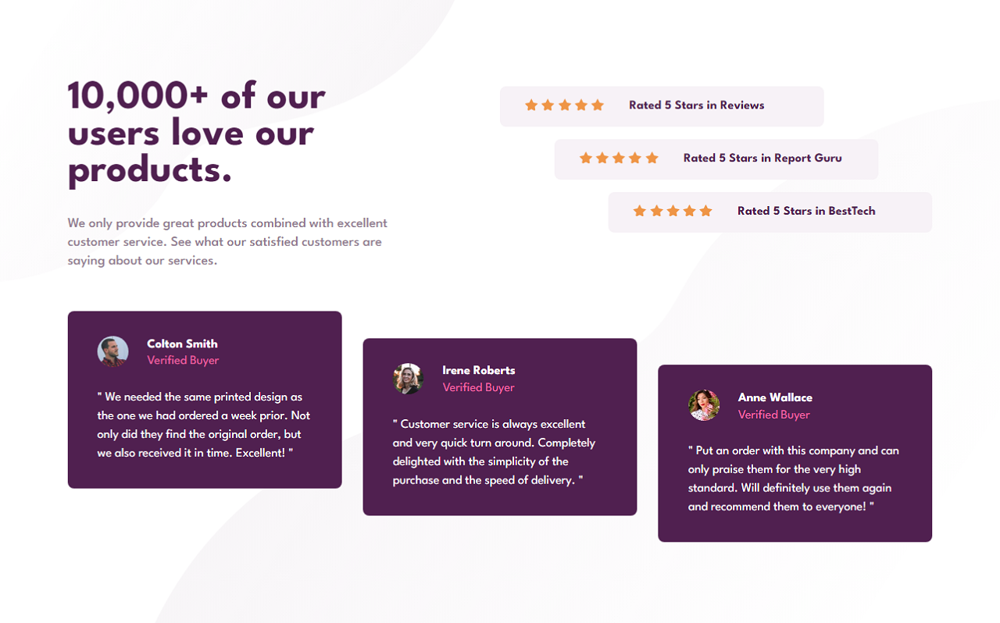
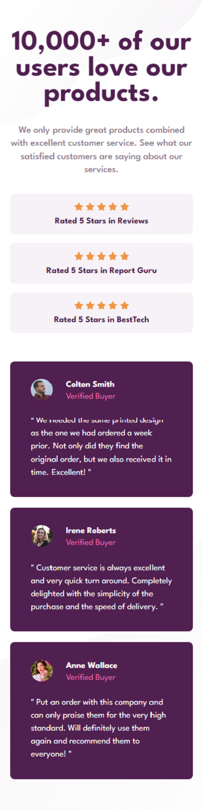

# Frontend Mentor - Social proof section solution

This is a solution to the [Social proof section challenge on Frontend Mentor](https://www.frontendmentor.io/challenges/social-proof-section-6e0qTv_bA).

## Overview

### The challenge

Users should be able to:

- View the optimal layout for the section depending on their device's screen size

### Screenshots




### Links

- Solution URL: [Social proof section](https://www.frontendmentor.io/solutions/social-proof-section-with-css-grid-and-flexbox-N8G-dW6_gv)
- Live Site URL: [Social proof section](https://fm-social-proof-section-master-omega.vercel.app/)

## My process

### Built with

- Modern HTML5 markup
- CSS custom properties
- CSS custom variables
- CSS Grid - to make structure for desktop
- Flexbox - make content flexible in div
- Mobile-first workflow - responsive design

### What I learned

You have to build a organized markup in html to design it with css as your desire.
And use CSS Grid to makes layout of your web page and organize divs using CSS Flexbox.
Example:

```css
.main-container {
  display: grid;
  grid-template-rows: 1fr 1fr;
}
.top {
  display: grid;
  grid-template-columns: 1fr 1fr;
}
.right {
  display: flex;
  flex-flow: column wrap;
}
```
### Continued development

You have to learn continous to improve your design.

## Author

- Frontend Mentor - [@ShadhinForever](https://www.frontendmentor.io/profile/ShadhinForever)
